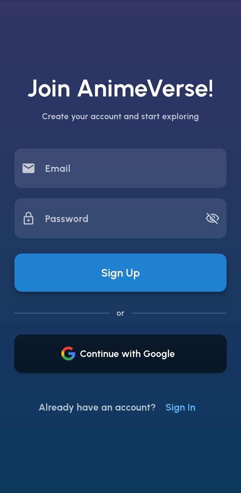
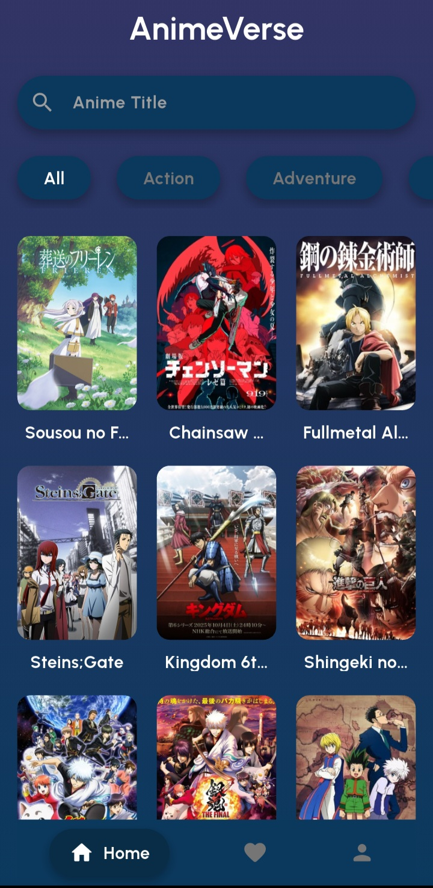
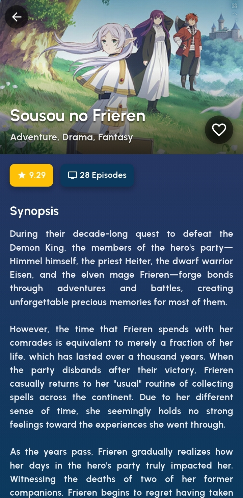
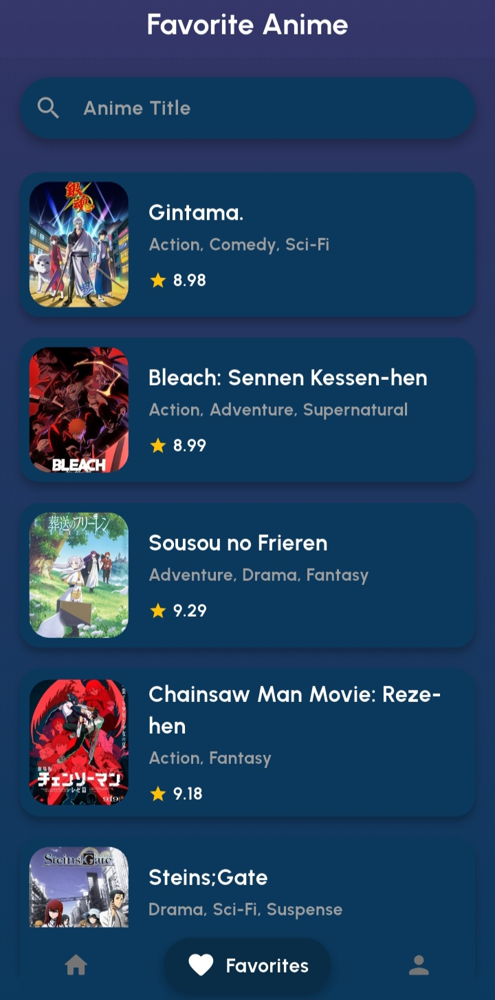
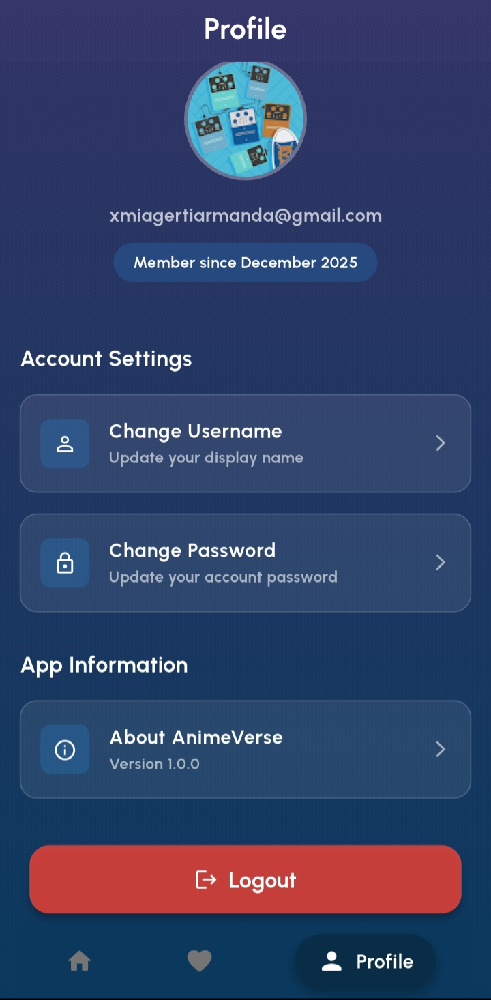

# 🎌 Anime Verse

**A modern anime discovery and tracking application built with Flutter**

---

## 📖 About

- Gerti Armanda Sembiring (231401133)
- Lab 2
- Project Description: Gudang Anime

---

## 📱 Screenshots

<table>
  <tr>
      <td> <b>Sign In</b></td>
          <td> <b>Sign Up</b></td>
              <td> <b>Home</b></td>
                </tr>
                  <tr>
                      <td> <b>Anime Detail</b></td>
                          <td> <b>Favorites</b></td>
                              <td> <b>Profile</b></td>
                                </tr>
                                </table>
---

## 📱 Demo
https://drive.google.com/file/d/1VWXndyUCV9sw1lgO3QIwbkRtlZ-AWOB3/view?usp=drivesdk

---

## Sumber
https://github.com/RivaldoPardede/IKLC-anime-verse